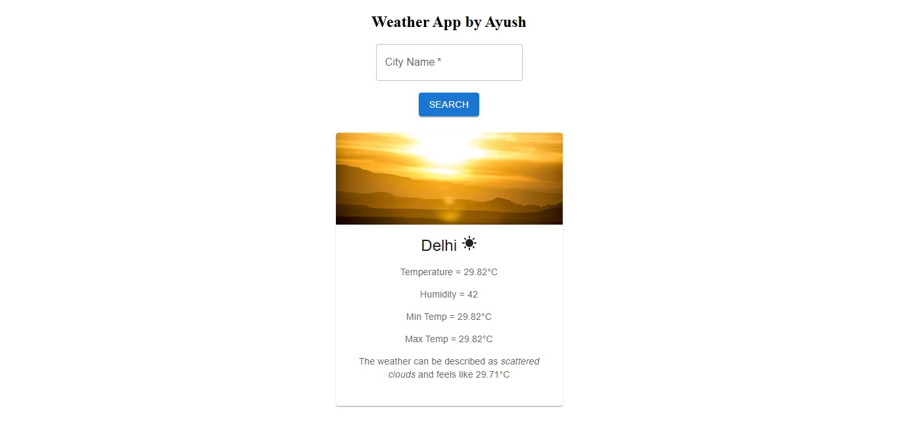

# 🌤️ Weather App

A responsive and modern weather application built with **React** and **OpenWeather API**, providing real-time weather updates for any city worldwide.

---

## 🚀 Features

-  Get live weather data (temperature, humidity, weather)
-  Search weather by city name
-  Built with React + Vite for fast performance
-  Clean, minimal, and user-friendly design

---

## 🛠️ Tech Stack

- **Frontend:** React, CSS
- **API:** OpenWeather API
- **Build Tool:** Vite
- **Version Control:** Git & GitHub

---

## 📸 Screenshot

>  
